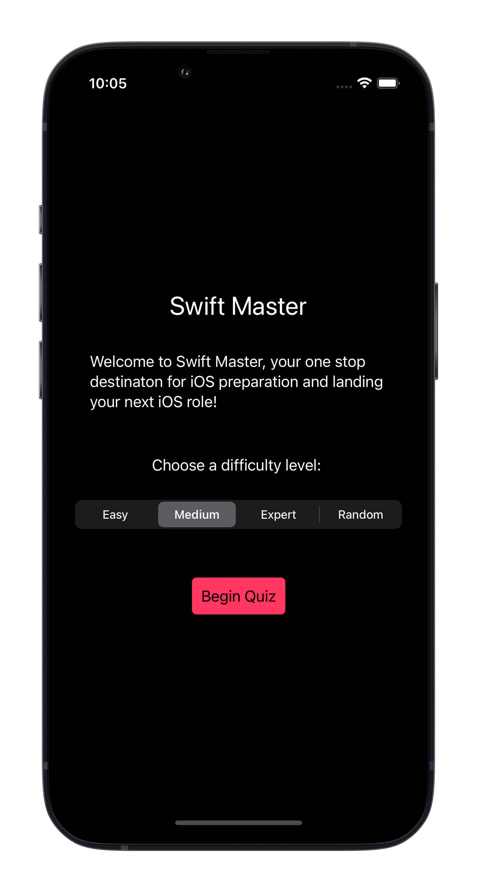
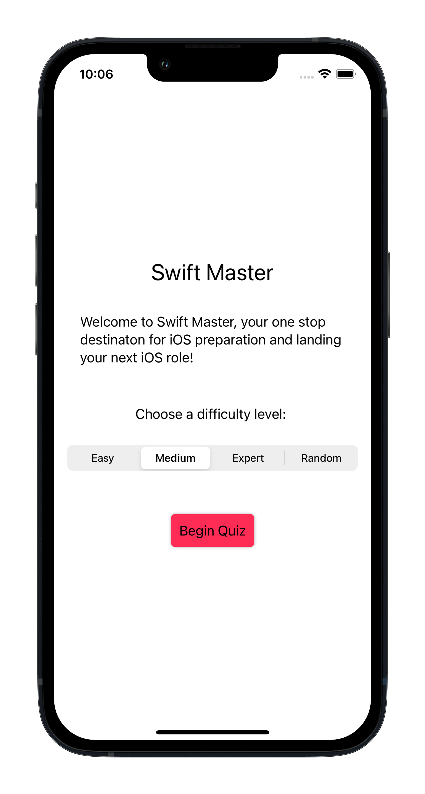
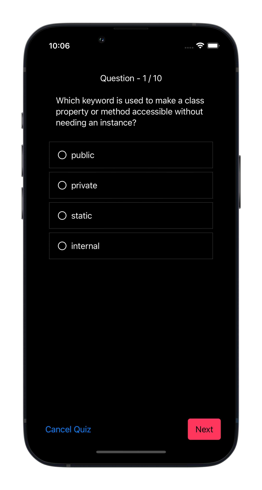
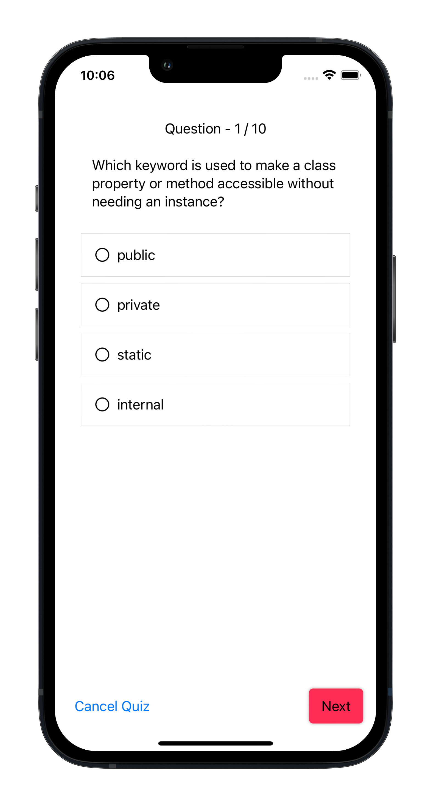
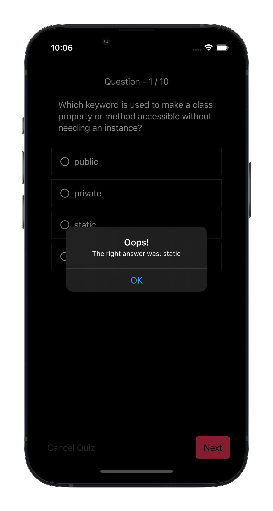
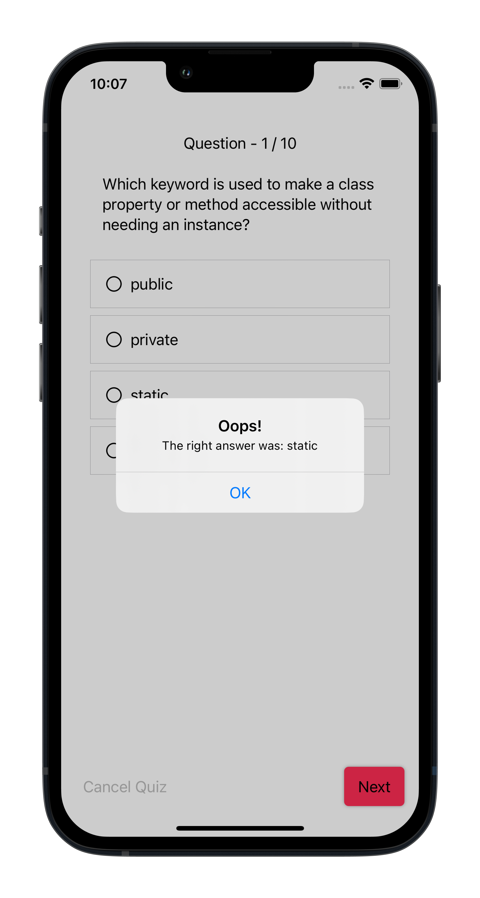
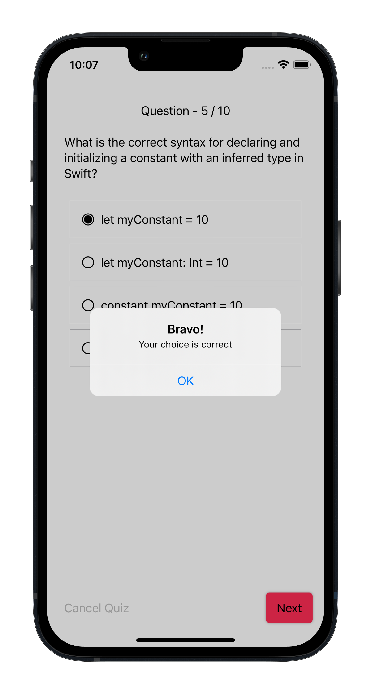
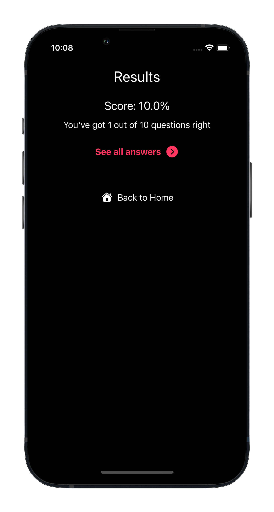
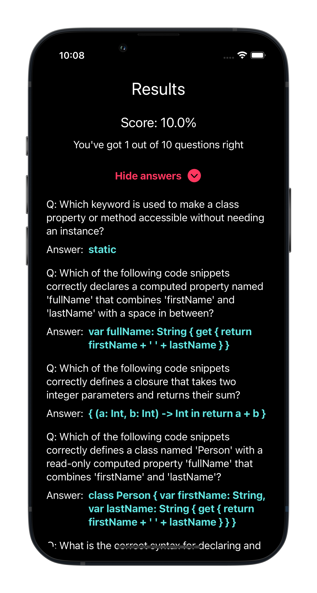

# Master Swift Quizzing App 🚀

Master Swift is an interactive quizzing app designed to challenge your knowledge of Swift programming language. Test your skills with questions of varying difficulty levels: easy, medium, and hard. Sharpen your Swift expertise and have fun along the way!

## Features

- **Multiple Difficulty Levels**: Master Swift offers questions of three difficulty levels: Easy, Medium, Hard and a random level. Choose your level and start quizzing!

- **Randomized Questions**: Each time you start a quiz, the questions are randomized, ensuring a fresh experience with every attempt.

- **Score Tracking**: Keep track of your scores for each quiz and aim for improvement in every round.

## Screenshots
1. Home Screen

2. Questions Screen

3. Results Screen

## Technologies Used

- SwiftUI: The app is built entirely using SwiftUI

- Firebase: The app uses Google's Cloud Firestore to fetch questions from

## Getting Started

To try out Master Swift on your iOS device, follow these steps:

1. Clone the repository to your local machine: `git clone https://github.com/maha0134/masterSwift.git`

2. Open the `MasterSwift.xcodeproj` file using Xcode.

3. Build and run the app on your iOS device or simulator.

4. Choose your difficulty level, and start the quiz!

## How to Contribute

We welcome contributions to Master Swift! If you'd like to contribute to the project, follow these steps:

1. Fork the repository.

2. Create a new branch for your feature or bug fix.

3. Make your changes and commit them.

4. Push your changes to your fork.

5. Submit a pull request to the `main` branch of the original repository.

Happy quizzing with Master Swift! 📚📱🤓

